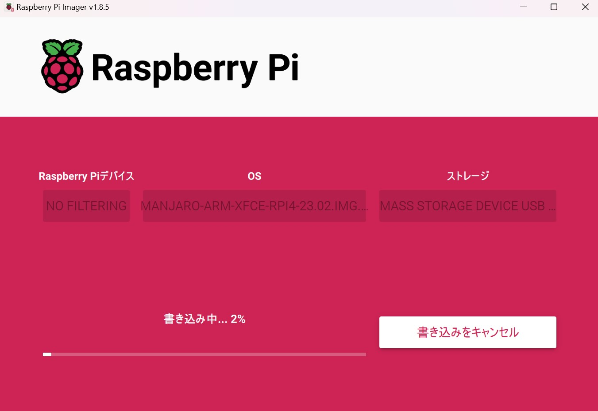

Manjaro + Xfce + i3 on respberry pi

※ sudo は省略

* Refresh micro SD card & Install OS on SD card
KIOXIA microSDHC UHS-I card

ref: https://docs.pikvm.org/flashing_os/#using-linux-cli-advanced-users

* Get manjaro OS

* Install manjaro OS

* Install latest repository update
$ pacman -Syu
D-busについて聞かれたら...
https://wiki.archlinux.jp/index.php/D-Bus

errors
https://www.reddit.com/r/pikvm/comments/17inmod/cant_update_packages_raspberrypiutils_and/?rdt=34903
  
* Install Japanese support
$ 
* Install network tools
$ pacman -S install iptables
